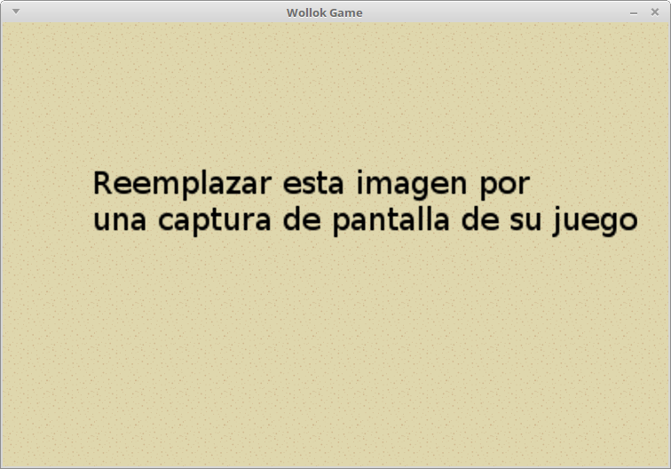

### arkanoid

#### Grupo: ArkanoidGroup

Integrantes:

- BARROS, BRAIAN EZEQUIEL
- CAMPERO, FEDERICO EZEQUIEL

#### Descripción e instrucciones

poblemas a solucinar para la primera entrega

 - hacer q gane cuando se terminan todos los bloques
 - hacer q pierda cuando toca la pered de abajo(q tenga varias oportunidades)
 - hay bloques q no se destruyen
 - q la pelota no entre en la misma casilla que la pared, es decir, que rebote
 - agregar barra normal
 